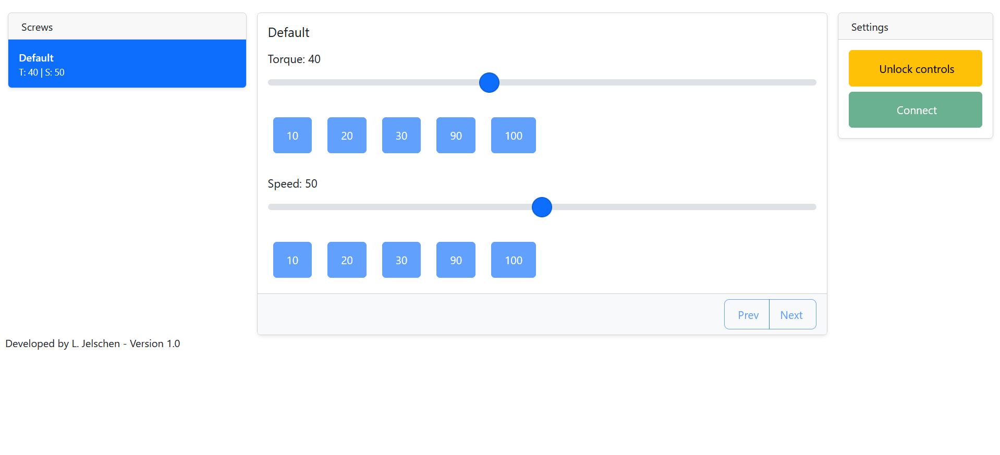
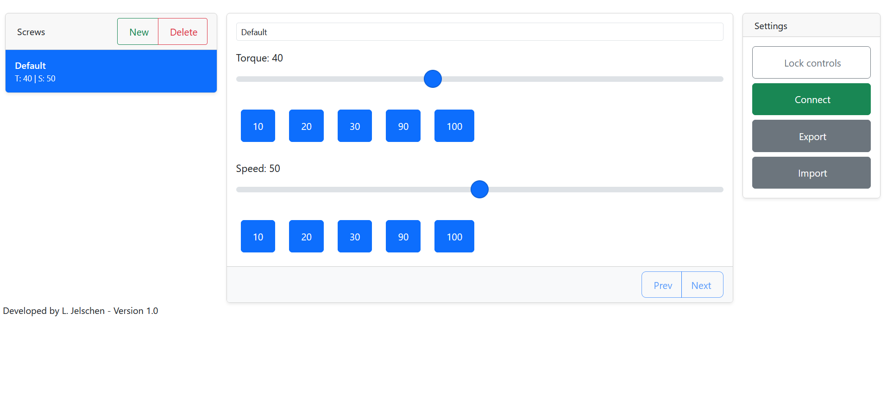

## Torque Screwdriver — Web Control Interface

Simple web interface to control a torque screwdriver via serial communication using a Chromium-based browser.

This small project provides a browser UI (served from the project root) that talks to a torque screwdriver over a serial port using the Web Serial API. It's intended to be opened with a Chromium browser (or compatible) and run from a local web server (localhost) so the browser will allow access to serial devices.

### Features

- Connect to a torque screwdriver over a serial port using the browser's Web Serial API
- Simple dashboard UI for locking/unlocking and monitoring torque
- Export data to Excel (uses included xlsx library)

### Included images

The `doku/img` folder contains two images used by the UI and shown here:





### Prerequisites

- A Chromium-based browser with Web Serial support (recent Chromium/Chrome/Microsoft Edge builds). Prefer a modern Chromium release.
- The project files (this repository) on your local machine.
- A torque screwdriver with a serial (USB) interface.

Note about Web Serial and origins: the Web Serial API requires a secure context. The easiest way to run this locally is to serve the files from localhost (a local web server). Avoid opening `file://` pages — use `http://localhost`.

### Running locally (quick)

Open a PowerShell terminal in the project root (where `index.html` lives) and run a simple HTTP server. Examples:

PowerShell (Python 3):

```powershell
cd C:\Users\lappi\Desktop\tc
python -m http.server 8000
```

Then open a Chromium browser and visit:

	http://localhost:8000

Open the page, then use the page's Connect/Select Port button to choose the screwdriver's serial port. The browser will prompt you to grant permission to the device.

If you prefer another server, any static server that serves from localhost will work (Node `http-server`, `live-server`, etc.).

### Usage

1. Start the local server and open `http://localhost:8000` in Chromium.
2. Click the Connect (or Select Port) button in the UI. Grant permission when the browser asks.
3. Use the dashboard controls to lock/unlock the screwdriver and monitor torque readings as they arrive.
4. Optionally export session data to Excel using the Export button.

### Security & privacy

The app asks the browser for access to your serial device; the browser handles permission prompts and user consent. The project does not transmit data outside your machine.

### Files of interest

- `index.html` — main UI
- `js/main.js` — UI logic
- `js/serialCom.js` — serial communication layer
- `js/uiFunctions.js` — helper UI functions
- `doku/img/` — contains UI images (referenced above)

### Contributing

If you'd like to improve the UI, add features, or fix bugs, please fork the repository and open a PR with a brief description of your changes.

### License

MIT License

Copyright (c) 2025 Lars Jelschen

Permission is hereby granted, free of charge, to any person obtaining a copy of this software and associated documentation files (the "Software"), to deal in the Software without restriction, including without limitation the rights to use, copy, modify, merge, publish, distribute, sublicense, and/or sell copies of the Software, and to permit persons to whom the Software is furnished to do so, subject to the following conditions:

The above copyright notice and this permission notice shall be included in all copies or substantial portions of the Software.

THE SOFTWARE IS PROVIDED "AS IS", WITHOUT WARRANTY OF ANY KIND, EXPRESS OR IMPLIED, INCLUDING BUT NOT LIMITED TO THE WARRANTIES OF MERCHANTABILITY, FITNESS FOR A PARTICULAR PURPOSE AND NONINFRINGEMENT. IN NO EVENT SHALL THE AUTHORS OR COPYRIGHT HOLDERS BE LIABLE FOR ANY CLAIM, DAMAGES OR OTHER LIABILITY, WHETHER IN AN ACTION OF CONTRACT, TORT OR OTHERWISE, ARISING FROM, OUT OF OR IN CONNECTION WITH THE SOFTWARE OR THE USE OR OTHER DEALINGS IN THE SOFTWARE.